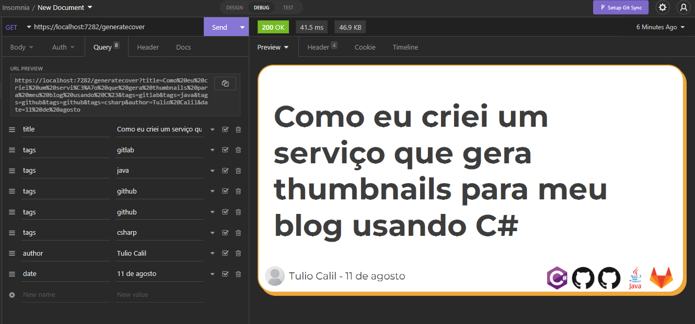

# Post Thumb Generator

<div align="center">



</div>

Este é um serviço bem simples e útil para gerar imagens de capa para postagens (criado para o blog [tuliocalil.com.br](https://tuliocalil.com.br)) escrito em C# com [Dotnet core](https://dotnet.microsoft.com/en-us/download).

## Como usar

A utilização é super simples, basta fazer uma chamada `GET` para o serviço na rota `/generatecover` passando os parâmetros requeridos e você terá como retorno uma imagem:

```bash
curl --request GET \
  --url 'https://localhost:7282/generatecover?title=Como%20eu%20criei%20um%20servi%C3%A7o%20que%20gera%20thumbnails%20para%20meu%20blog%20usando%20C%23&tags=gitlab&tags=java&tags=github&tags=github&tags=csharp&author=Tulio%20Calil&date=11%20de%20agosto'
```

### Parâmetros disponíveis

| Nome   | Descrição                                                      | Requerido |
| ------ | -------------------------------------------------------------- | --------- |
| title  | Titulo da postagem                                             | Sim       |
| tags   | Array com nome das tecnologias envolvidas para gerar os ícones | Não       |
| date   | Data da postagem                                               | Não       |
| author | Nome do autor da postagem                                      | Não       |

### Tags de tecnologia

As tags são um array de string sendo utilizadas para adicionar ícones na thumb.
Você pode consultar os ícones suportados atualmente visitando a pasta [src/DotNetCover/Assets/Images/Techs](https://github.com/tuliocll/post-thumb-generator/tree/master/src/DotNetCover/Assets/Images/techs).

## Rodando local

Instale o [Dotnet core](https://dotnet.microsoft.com/en-us/download).
https://github.com/tuliocll/post-thumb-generator/tree/master/src/DotNetCover/Assets/Images/techs
Clone o projeto:

```bash
git clone git@github.com:tuliocll/post-thumb-generator.git
```

Rode o projeto:

```bash
dotnet watch
```

## Próximos passos

- Aceitar configuração do tema via request (tamanho da imagem, qualidade, cores, bordas etc)
- Adicionar possibilidade de upload da imagem para providers (AWS S3 ou Cloudinary)
- Receber imagem do autor via request

<div align="center">

### Made with 💙 in Bahia, Brasil.

</div>
